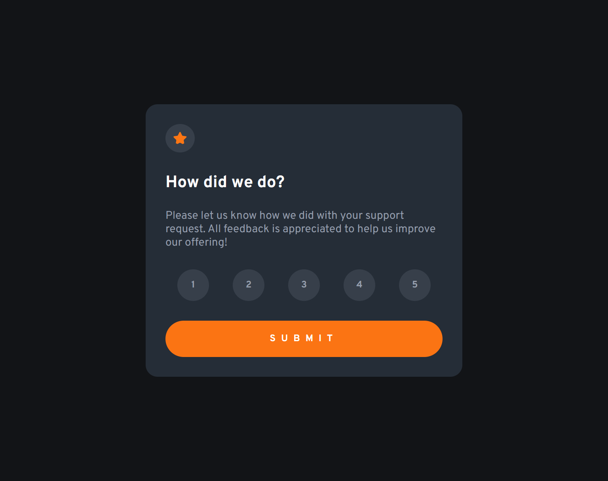
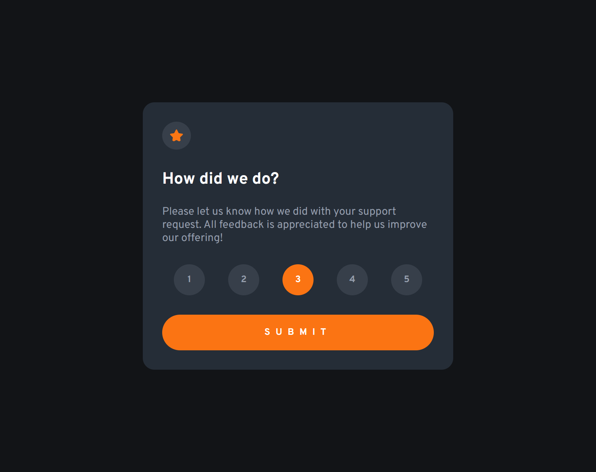
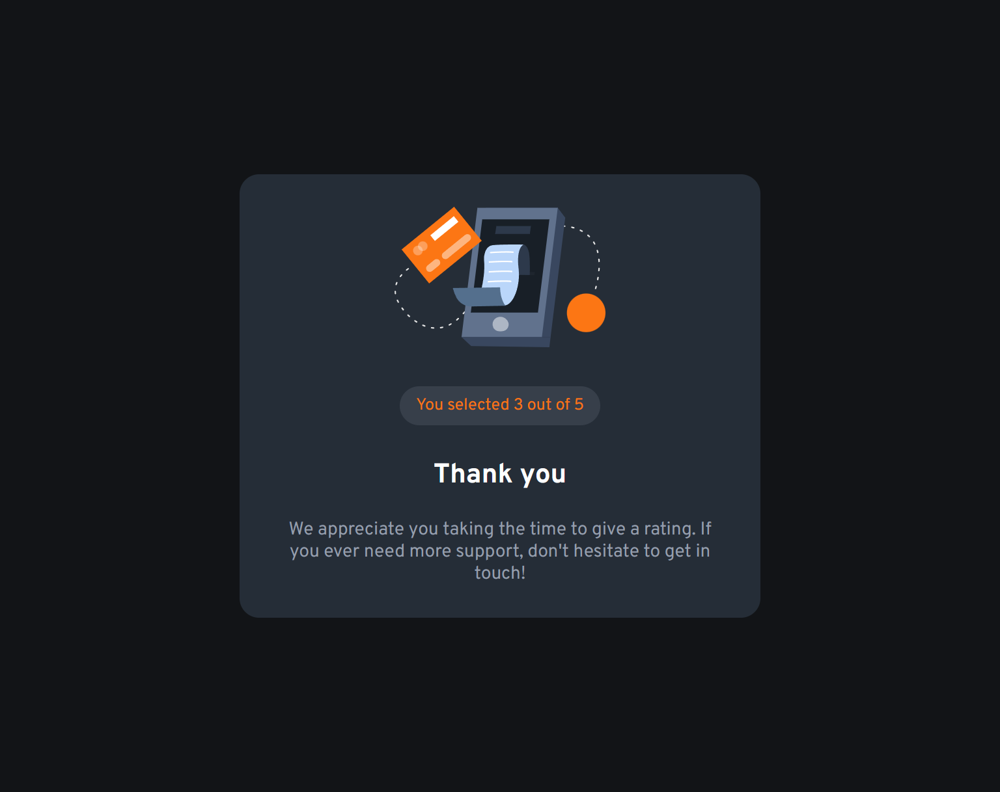

# Frontend Mentor - Interactive rating component solution

This is a solution to the [Interactive rating component challenge on Frontend Mentor](https://www.frontendmentor.io/challenges/interactive-rating-component-koxpeBUmI). Frontend Mentor challenges help you improve your coding skills by building realistic projects. 

## Table of contents

- [Overview](#overview)
  - [The challenge](#the-challenge)
  - [Screenshot](#screenshot)
  - [Links](#links)
- [Author](#author)

**Note: Delete this note and update the table of contents based on what sections you keep.**

## Overview

### The challenge

Users should be able to:

- View the optimal layout for the app depending on their device's screen size
- See hover states for all interactive elements on the page
- Select and submit a number rating
- See the "Thank you" card state after submitting a rating

### Screenshot

### Links

- Solution URL: [Repository](https://github.com/Sarkastherin/interactive-rating.git)
- Live Site URL: [Live demo](https://sarkastherin.github.io/interactive-rating/)

## Author
- Frontend Mentor - [@Sarkastherin](https://www.frontendmentor.io/profile/Sarkastherin)
- Twitter - [@sarkastherin](https://www.twitter.com/sarkastherin)
